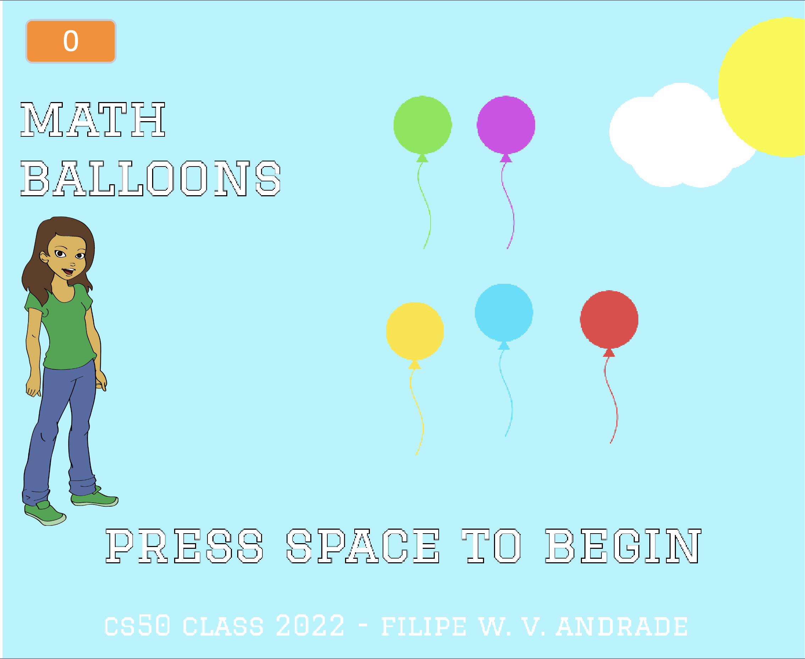

# Math Ballooms

Game made in Scratch
Scratch is a high-level block-based visual programming language and website aimed primarily at children as an educational tool for programming, with a target audience of ages 8 to 16. Users on the site, called Scratchers, can create projects on the website using a block-like interface.

Game for educational purposes. 
Estimulate the resolution of problems using arithmetic. Find the correct sum to win!

# Play

https://scratch.mit.edu/projects/703413868/

